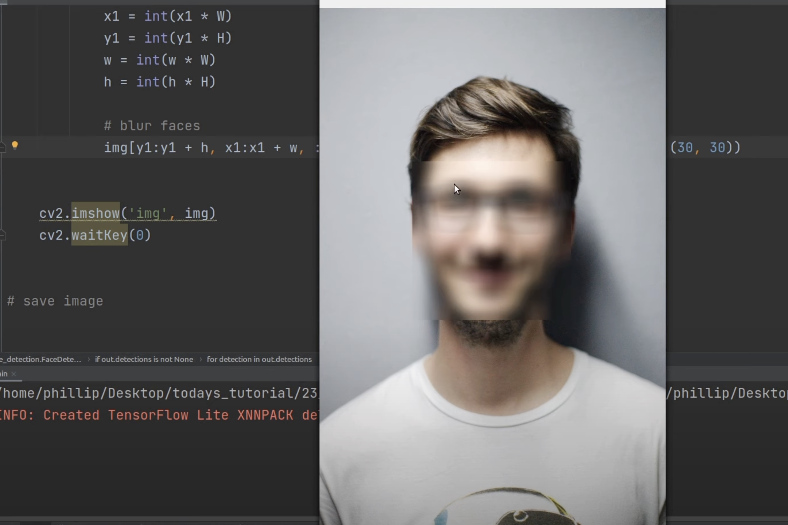

# Визначення кольору з OpenCV

Цей проєкт дозволяє виявляти певні кольори в режимі реального часу за допомогою вебкамери та бібліотеки OpenCV.  
Він використовує колірний простір HSV для ізоляції бажаного кольору та створює маску, яка підсвічує області з цим кольором.

## 📷 Як це працює

- Захоплення відео з вебкамери.
- Перетворення кожного кадру в HSV.
- Визначення HSV-діапазону на основі заданого кольору (наприклад, `[255, 0, 0]` для синього у BGR).
- Створення маски, що виділяє відповідні пікселі.

## 🔧 Встановлення

```bash
git clone https://github.com/your-username/your-repo.git
cd your-repo
pip install -r requirements.txt
```

## 🚀 Запуск програми

```bash
python ColorDetection.py
```

_Примітка: якщо ви використовуєте Jupyter Notebook, можна залишити `.ipynb` файл або експортувати в `.py`._

## 🧪 Приклад



## 📂 Дані

Цей проєкт не потребує датасету — він працює напряму з камери в реальному часі.

## 📜 Ліцензія

MIT — додається через GitHub інтерфейс.

---

Зроблено з ❤️ за допомогою OpenCV.
